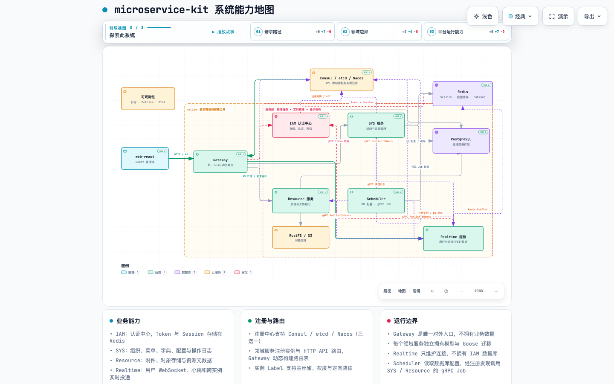

# microservice-kit

`microservice-kit` 是一个渐进式微服务后台脚手架 Monorepo：`native` 提供业务语义与 HTTP 契约基线，`web-react` 是统一前端，`kratos` 和 `gozero` 只是同一能力的框架化实现方式。

## 先看系统能力

点击打开可交互的系统能力地图：**[打开动态能力地图](system-capability-map/system-capability-map.html)**

地图支持缩放、搜索、关系追踪、主题切换和按场景聚焦：



地图只描述 `native` 的真实能力边界，不把 Kratos / go-zero 的包结构当成业务能力。源规格见 [system-capability-map/system-capability-map.json](system-capability-map/system-capability-map.json)。

## 能力与边界

```text
web-react ──统一 HTTP / WS──> Gateway ──动态路由──> IAM / SYS / Resource
                                  │                    │   │       │
          Consul / etcd / Nacos ──实例 + API 路由注册──────┘   └─ PostgreSQL
                                  │
                                  ├─ WS 连接 ──> Realtime ──IAM gRPC 校验
                                  │                 │
                                  │                 └─ Redis Pub/Sub ──> Realtime 集群内本地连接
                                  │
                                  └─ Gateway 内：鉴权 / 反向代理 / Label 路由

IAM 认证中心 ──Token / Session──> Redis
SYS ──运行配置 / 缓存──> Redis
Resource ──对象读写──> RustFS / S3
Scheduler ──读取配置──> PostgreSQL
Scheduler ──注册发现 + gRPC──> SYS / Resource
SYS / Resource / Scheduler ──PublishToUsers gRPC──> Realtime
```

- **Gateway**：唯一对外 HTTP / WS 入口，负责路由、反向代理和统一 OpenAPI，不拥有业务数据。
- **IAM**：认证中心，负责身份、用户、角色、API 权限及 Token 生命周期；Token 与 Session 存储在 Redis。
- **SYS**：组织、菜单、字典、系统配置与操作日志。
- **Resource**：附件、资源元数据与对象存储。
- **Realtime**：独立维护用户 WebSocket 连接、心跳和本地投递；通过 IAM gRPC 校验握手 Token，通过 Redis Pub/Sub 将消息广播到所有 Realtime 实例。
- **Scheduler**：异步任务服务，不接收外部 HTTP 流量；直接读取 PostgreSQL 配置并使用注册中心，间接通过 SYS/Resource gRPC 操作日志、附件数据和对象存储。
- **注册与路由**：注册中心支持 Consul、etcd、Nacos（三选一），承载 API 颗粒度服务实例注册；Gateway 根据注册元数据动态构建路由表。
- **API 流量治理**：Gateway 根据实例 Label 路由流量，支持金丝雀、灰度和定向流量。
- **共享运行能力**：gRPC、PostgreSQL、Redis、RustFS/S3、日志、Metrics 与 OpenTelemetry。

### 服务调用链路

#### HTTP / WebSocket 请求

```text
web-react
  -> Gateway: HTTP 或 /realtime/websocket
  -> Gateway -> IAM: 校验 Access Token（HTTP 请求统一前置鉴权）
  -> Gateway -> IAM / SYS / Resource: 反向代理到动态路由实例
  -> Gateway -> Realtime: WebSocket 握手请求
  -> Realtime -> IAM: ValidateAccessToken（建立连接前再次校验）
  -> Realtime: 在当前实例保存连接并执行心跳
```

WebSocket 连接建立后由选中的 Realtime 实例持续持有，不需要粘性会话；客户端重连时由 Gateway 重新选择健康实例。

#### 业务消息推送

```text
SYS / Resource / Scheduler
  -> Realtime gRPC: PublishToUsers(user_ids, type, data_json)
  -> 任一 Realtime 实例
  -> Redis Pub/Sub: microservice-kit:realtime:deliver:v1
  -> 每个 Realtime 实例收到同一消息
  -> 只有持有目标用户连接的实例执行 WebSocket 发送
```

`PublishToUsers` 是尽力而为的实时提醒，不代表客户端已经收到。不能丢失的通知由所属领域持久化，客户端重连后通过领域 API 查询最终状态。业务服务依赖 Realtime gRPC，不直接依赖 Redis channel。

渐进拆分沿事务、数据所有权和独立部署边界进行。每个领域服务在自己的 `internal/` 中拥有业务代码、数据模型和 Goose 迁移；不按 controller 数量拆服务，也不提前引入共享业务层或分布式事务。

## 工程组成

```text
microservice-kit/
├── native/      # 原生 Go 微服务实现，业务与 HTTP 契约基线
├── kratos/      # Kratos 框架实现（展示方式）
├── gozero/      # go-zero 框架实现（展示方式）
├── web-react/   # React + TypeScript 管理端
├── system-capability-map/ # 交互式能力地图、规格与预览
├── AGENTS.md    # 开发约定
└── README.md
```

详细的 native 启动、配置、认证、迁移和部署说明见 [native/README.md](native/README.md)。前端说明见 [web-react/README.md](web-react/README.md)。

## 快速启动 native

依赖 Go 1.26.5、PostgreSQL 16、Redis 7、RustFS 和 Consul：

```bash
cd native
make init-config
export MS_K_APP_ENV=dev
```

按需修改各服务的 `conf.dev.yaml`，再启动真实微服务进程：

```bash
go run ./application/iam
go run ./application/sys
go run ./application/resource
go run ./application/realtime
go run ./application/gateway
go run ./application/scheduler
```

或用 Docker Compose 启动完整栈：

```bash
cd native
export MS_K_JWT_SECRET='replace-with-at-least-32-random-characters'
docker compose up --build
```

## 开发与质量检查

各 Go 子工程拥有独立 `go.mod`，在对应目录执行命令：

```bash
(cd native && make ci)
(cd kratos && make proto-all && make ent && make wire && make test && make build-all)
(cd gozero && go test ./... && make build-all)
(cd web-react && pnpm install && pnpm build)
```

## 契约原则

- `native` 定义接口路径、参数、响应、错误语义和业务规则。
- `kratos` / `gozero` 可以改变工程分层，但不得改变对外业务语义。
- `web-react` 只依赖一套 HTTP 契约，不为不同后端写兼容分支。
- 生成代码用对应框架命令重新生成，不手工修改生成结果。
- 新工程默认不兼容旧配置、旧接口或旧数据；只有明确要求时才添加兼容逻辑。

完整约定见 [AGENTS.md](AGENTS.md)。
